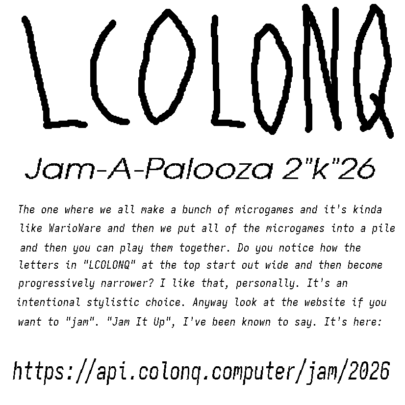

#+title: LCOLONQ Jam-A-Palooza 2K26

This repository contains the testing harness for the 2026 LCOLONQ game jam.

More details are available here: [[https://api.colonq.computer/jam/2026]].

* Usage
Run

#+begin_src shell
cargo run
#+end_src

in this directory. This will open your web browser and load the game collection.
This will require that you have a ~cargo~ and a recent Rust toolchain installed.
If this is irritating, you can also download prebuilt binaries [[here

In order to add your own game(s), simply create a new folder under ~./games~.
Make sure that this folder has an ~index.html~ file inside!
Restart the harness, and it should automatically detect your game and add it to the rotation.

Note that this is all still very early stages, so things may evolve and churn unexpectedly.
Here be dragons!

